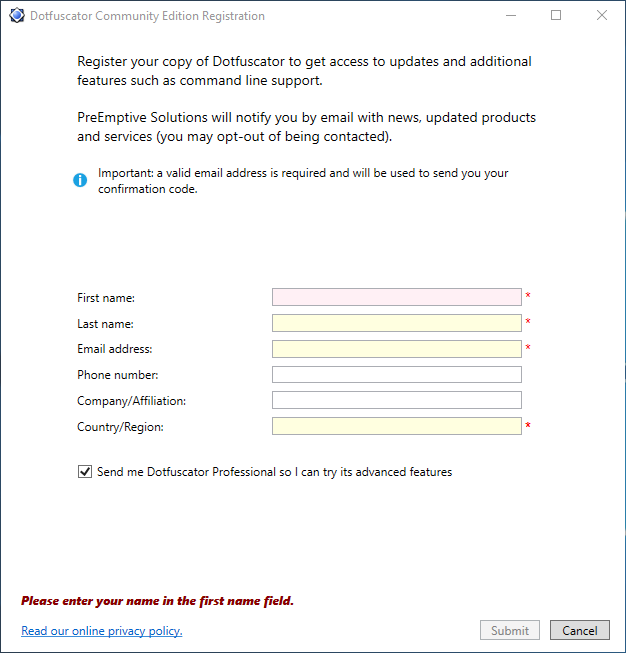
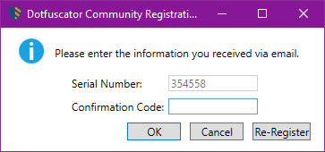

# Register Dotfuscator Community

## Why Register?

Registered users of Dotfuscator Community get access to additional features, such as [command line support][cli], which makes it easy to integrate Dotfuscator into your automated build process.
In addition, registering will grant access to a built-in tool used for efficiently [decoding obfuscated stack traces][decode-obfuscated].

Registration is quick, simple, and free of charge.

## Registration Instructions

After [installation][install], you can register Dotfuscator Community via the [graphical user interface][gui].
Open this interface by going to Visual Studio's **Tools** menu and selecting **PreEmptive Protection - Dotfuscator Community**

If this is your first time running Dotfuscator Community, you will be presented with an End User License Agreement; once this is accepted, the registration form will appear.

If you have already run Dotfuscator Community, but have not yet registered it, you can view the registration form by opening the **Help** menu and selecting **Register Product...**.

Some of the fields in the registration form may already be filled based on your Visual Studio account.
Ensure these are correct, then fill in the remaining fields and click *Submit*.

After submitting your registration, a dialog will appear asking for your *confirmation code*.
You will receive an email from PreEmptive containing this code.
Enter the code and click *OK* to complete your registration.

> [!NOTE]
> If you initially Cancel the confirmation dialog, you can view it again in Dotfuscator's graphical user interface by opening the **Help** menu and selecting **Register Product...**.

Once registration is complete, you will immediately be able to use additional features, such as the [command line interface][cli].

If you checked *Send me Dotfuscator Professional so I can try its advanced features* when registering, you will also receive information on how to obtain an evaluation copy of [Dotfuscator Professional][get-pro].
You can use your email to create an account for the [members section of preemptive.com][members], where you can manage evaluations.

<!-- No see-also link yet, need the docs on the PreEmptive side to be posted publicly -->

<!-- Copyright © 2021 PreEmptive Solutions, LLC -->

[install]: install.md
[get-pro]: upgrades.html

[gui]: https://www.preemptive.com/dotfuscator/ce/docs/help/getting_started_gui.html
[gui-start]: https://www.preemptive.com/dotfuscator/ce/docs/help/getting_started_gui.html#overview
[cli]: https://www.preemptive.com/dotfuscator/ce/docs/help/getting_started_cli.html
[decode-obfuscated]: https://www.preemptive.com/dotfuscator/ce/docs/help/gui_decode_stack_trace.html

[members]: https://www.preemptive.com/my-account